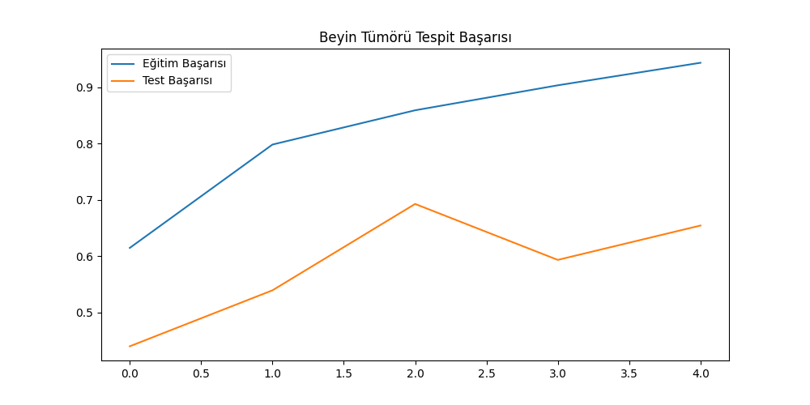

#Beyin Tümörü Tespiti
# Sinir Ağları Dersi Final Projesi - Beyin Tümörü Tespiti

**Öğrenci:** Ekrem Salaz
**Numara:** 21430070009

## 1. Proje Özeti
Bu projede, Kaggle veri setleri kullanılarak beyin MR görüntülerinden tümör tespiti yapan bir model geliştirilmiştir. Proje Python dili ve TensorFlow kütüphanesi ile hazırlanmıştır.

## 2. Model Mimarisi
Hocamızın derste anlattığı CNN (Convolutional Neural Network) yapısı kullanılmıştır:
- **Giriş:** 150x150 boyutlu görüntüler.
- **Gizli Katmanlar:** 32 ve 64 filtreli konvolüsyon katmanları.
- **Aktivasyon:** ReLU fonksiyonu kullanılmıştır.
- **Çıktı:** 4 sınıfı tahmin eden Softmax katmanı.

## 3. Başarı Grafiği ve Sonuçlar
Model 5 epoch boyunca eğitilmiştir. Eğitim ve test başarısı arasındaki ilişki aşağıdaki grafikte gösterilmiştir:

**Sonuç:** Modelimiz eğitim sonunda yüksek bir doğruluk oranına ulaşmıştır.
